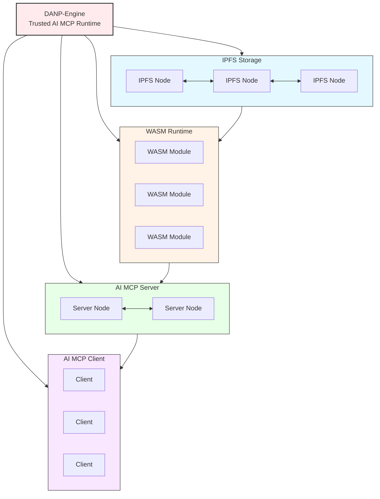

# DANP-Engine


**DANP-Engine** is a trusted AI MCP runtime built on **IPFS**, **WASM**, **AI MCP Server** and **AI MCP Client**. The AI MCP tools modules are stored on decentralized IPFS immutable trusted storage. This innovative framework seamlessly integrates WebAssembly computing, IPFS storage, and AI Agent capabilities to deliver a robust, serverless solution for decentralized applications (dApps). Designed to empower developers with cutting-edge technologies, this project revolutionizes decentralized computing by combining the efficiency of WASM, the reliability of IPFS, and the intelligence of AI Agents.


---

## Key Features and Components

- **WebAssembly Computing**: Harness the power of WebAssembly for efficient, scalable, and portable computation within decentralized applications.
- **IPFS Integration**: Utilize IPFS for secure, decentralized storage and retrieval of data, ensuring data integrity and availability.
- **AI Agent Capabilities**: Empower your applications with intelligent decision-making, automation, and multi-agent control powered by AI.
- **Serverless Architecture**: Embrace a serverless paradigm for flexible, cost-effective deployment of dApps, eliminating the complexities of traditional server management.
- **Technical Support**: Benefit from seamless integration with **Filecoin-Lassie** for IPFS file retrieval, **Filecoin-IPLD-Go-Car** for IPFS Car file extraction, **Extism** for WASM plugin management, **wazero** for WASM virtual machine, and **Fiber** for high-performance HTTP server capabilities.

---
## System Architecture


The architecture consists of four main layers:

* IPFS Storage Layer: Decentralized storage network that provides content-addressable storage for WASM modules and application data
* WASM Runtime Layer: Distributed execution environment where WASM modules run with AI Agent capabilities
* Application Layer: Core functionalities exposed to developers including Edge AI, Trusted Computing and Edge Functions
* Services Layer: Final output services that applications can consume (Compute, Storage, Network)

## How It's Made

**DANP-Engine** is built on four core components that work together to provide a trusted AI MCP runtime:

### IPFS Foundation
- **Role**: Provides decentralized, immutable storage for WASM modules and AI tools
- **Implementation**: 
  - Integrated IPFS nodes for distributed content addressing
  - Uses Filecoin-Lassie for efficient IPFS file retrieval
  - Supports IPFS Car file extraction via Filecoin-IPLD-Go-Car

### WASM Runtime
- **Role**: Executes trusted, portable code in a secure sandbox
- **Implementation**:
  - Leverages wazero for efficient WASM execution
  - Uses Extism for WASM plugin management
  - Supports both local and IPFS-hosted WASM modules

### AI MCP Server
- **Role**: Hosts and manages AI tools and services
- **Implementation**:
  - Built with Fiber for high-performance HTTP serving
  - Provides tool registration and discovery
  - Manages WASM module lifecycle and execution

### AI MCP Client
- **Role**: Interfaces with the MCP Server and provides user access
- **Implementation**:
  - Supports multiple client implementations (CLI, Web, etc.)
  - Provides tool discovery and invocation
  - Handles authentication and session management

### Integrated Benefits
- **Trusted Execution**: Combines IPFS immutability with WASM sandboxing
- **Decentralized AI**: Enables distributed AI tool hosting and execution
- **Interoperability**: Standard MCP protocol connects all components

---

## Quick Start

### 1. Clone the Repository
```bash
git clone https://github.com/IceFireLabs/DANP-Engine.git
```

### 2. Build the Project
```bash
cd DANP-Engine
make
```

### 3. Adjust Configuration File
```yaml
# MCP Server Manifest
server_config:
  host: "0.0.0.0"
  port: 18080
  max_connections: 100
  timeout: 30s

ipfs:
  enable: true  # Set to true to enable IPFS support
  lassie_net:
    scheme: "http"  # http or https
    host: "127.0.0.1"
    port: 31999
  cids: []  # Optional list of pre-loaded CIDs

llm_config:
  base_url: ""  # Optional base URL for API endpoints
  provider: "openai"  # Default provider
  openai:  # OpenAI-specific config
    api_key: ""
    model: "gpt-4"
    temperature: 0.7
    max_tokens: 2048
  # Add other provider configs here as needed

# Defines WASM modules and their exposed MCP tools
modules:
  - name: "hello"
    #wasm_path: "file:///home/corerman/ICODE/IceFireLabs/dANP-Engine/config/hello.wasm"  # Supports file:// or IPFS:// schemes
    wasm_path: "IPFS://QmeDsaLTc8dAfPrQ5duC4j5KqPdGbcinEo5htDqSgU8u8Z"  # Supports file:// or IPFS:// schemes
    tools:
      - name: "say_hello"
        description: "Greet someone by name"
        inputs:
          - name: "name"
            type: "string"
            required: true
            description: "Name to greet"
        outputs:
          type: "string"
          description: "Greeting message"

```

### 4. Load Configuration and Run MCP Server
```bash
go run cmd/DANP-MCP-SERVER/main.go
```

### 5. Interact with MCP Server using Client
```bash
go run cmd/DANP-MCP-CLIENT/main.go -http http://localhost:18080/
```

### 6. Example AI Interaction
```bash
# Server startup log showing WASM module loading from IPFS
2025/06/29 14:06:10 Loading WASM module from IPFS CID: QmeDsaLTc8dAfPrQ5duC4j5KqPdGbcinEo5htDqSgU8u8Z
2025/06/29 14:06:10 Successfully loaded WASM module: IPFS://QmeDsaLTc8dAfPrQ5duC4j5KqPdGbcinEo5htDqSgU8u8Z
2025/06/29 14:06:10 Registering tool: say_hello
2025/06/29 14:06:10 MCP server listening on 0.0.0.0:18080

# Client interaction example
Enter your request (empty line to submit, 'exit' to quit):
> Could you please greet my friend John for me?
> 

AI Response:
I've greeted your friend John for you! Here's the message: 

👋 Hello John
```

---

## Contributing

We welcome contributions from the community! To contribute to **DANP-Engine**:

1. Fork the repository.
2. Create a new branch (`git checkout -b feature/your-feature`).
3. Make your changes and commit them (`git commit -am 'Add new feature'`).
4. Push your changes to the branch (`git push origin feature/your-feature`).
5. Create a new Pull Request.

---

## ❤️ Thanks for Technical Support ❤️

1. [**Filecoin-Lassie**](https://github.com/filecoin-project/lassie/): Support IPFS file retrieval.
2. [**Filecoin-IPLD-Go-Car**](https://github.com/ipld/go-car): Support IPFS Car file extraction.
3. [**mcp-go**](https://github.com/mark3labs/mcp-go): High-performance HTTP server.
